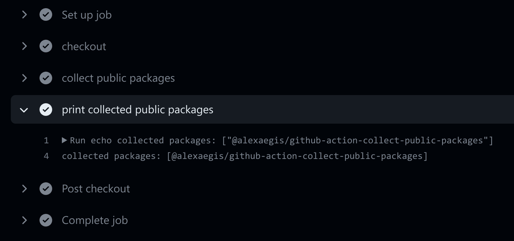

# [collect-public-packages](https://github.com/marketplace/actions/collect-public-packages)

[](https://www.npmjs.com/package/@alexaegis/collect-public-packages)
[](https://github.com/AlexAegis/collect-public-packages/actions/workflows/cicd.yml)
[](https://www.codacy.com/gh/AlexAegis/collect-public-packages/dashboard?utm_source=github.com&utm_medium=referral&utm_content=AlexAegis/collect-public-packages&utm_campaign=Badge_Grade)
[](https://codecov.io/gh/AlexAegis/collect-public-packages)



This action scans your workspace (Based on `pnpm-workspace.yaml` and the
`workspace` propery in your `package.json` file) for packages and outputs the
name of every package where the property `private` is explicitly set to `false`.

My usecase is to construct a job matrix strategy to release every public package
in a repository.

A job matrix would fail to construct if its array is empty. For this reason this
action only outputs non-empty arrays. If there are no public packages within the
repository it outputs nothing. This makes it trivial to use the same output as a
condition for the job.

## Example workflow

> For a real-world usecase check the workflows of this repository!

```yaml
name: simple-test

on:
  workflow_dispatch:
  push:
    branches: '**'

jobs:
  collect:
    runs-on: ubuntu-latest
    outputs:
      publicPackageNames:
        ${{ steps.collectPackages.outputs.publicPackageNames }}
    steps:
      - name: checkout
        uses: actions/checkout@v3
        with:
          fetch-depth: 1
      - name: collect public packages
        id: collectPackages
        uses: alexaegis/collect-public-packages@release
  print:
    runs-on: ubuntu-latest
    if: ${{ needs.collect.outputs.publicPackageNames }}
    strategy:
      matrix:
        package: ${{ fromJSON(needs.collect.outputs.publicPackageNames) }}
    needs: [collect]
    steps:
      - name: print package name
        run: |
          echo package: ${{ matrix.package }}
```
